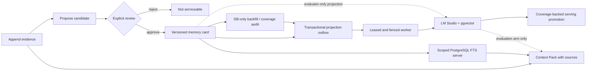

# Go Agent Memory System

A Go-native, evidence-first memory service for agents. It separates raw conversation evidence, untrusted memory proposals, reviewed/versioned memory cards, and the Context Pack assembled for one request.

> **Current status: durable PostgreSQL vertical slice plus measured lexical and dense retrieval components.** The server binary still uses PostgreSQL FTS. Approved cards atomically enqueue content-free projection jobs, a separate leased/fenced worker can project them through local LM Studio into pgvector, a DB-only reconciler can idempotently backfill and audit one stable target generation, and a coverage-backed transaction can atomically promote one serving space. Dense/hybrid server retrieval is not implemented. An independently selectable evaluation arm measures exact cosine retrieval without presenting that evaluator path—or a serving-space selection—as the production server.

## Why this project exists

An agent checkpoint answers “where should this run resume?” Agent memory answers a different question: “which reviewed facts from earlier sessions are relevant now, and what evidence supports them?” Treating those as the same system makes unverified model output look like durable truth.



The implemented invariants are:

- A candidate is never retrievable before explicit approval.
- Every candidate references source evidence in the same tenant/user scope.
- Approval atomically reviews the candidate, supersedes the prior active identity, inserts version `n+1`, and advances the scope revision.
- When projection targets are enabled, that same approval transaction creates one durable, content-free job per eligible embedding space; rejection creates none.
- The worker claims one job at a time using a database-clock lease, releases all database locks before embedding HTTP, and atomically fences vector persistence with job acknowledgement.
- Backfill scans a stable deployment generation in bounded pages and repairs only PostgreSQL jobs/derived vectors; audit does not mutate projection/card state and fails unless aggregate coverage is complete.
- Promotion revalidates every serviceable card at one PostgreSQL cutoff, compare-and-swaps the serving target, advances every live scope revision plus the deployment generation, and records an immutable idempotency receipt in one transaction.
- Each worker attempt binds the public probe and versioned card document in one bounded embedding request; a public-probe behavior mismatch is terminal for that job. This detects probe-visible drift, not full model identity or weights.
- PostgreSQL keys, foreign keys, and queries carry both `tenant_id` and `user_id`.
- A Context Pack uses one request-time `as_of` value and returns only active, unexpired cards with the source evidence needed to audit them.
- User erasure transactionally removes evidence, candidates, identity chains, and every card version while retaining a monotonic, content-free revision row.

## Evidence and boundaries

| Capability | Executable evidence | Current boundary |
| --- | --- | --- |
| Evidence → candidate → review → memory | Unit, HTTP, and real PostgreSQL contract tests | Reviewer ID is caller-supplied; no authentication yet |
| Transactional conflict versioning | Concurrent approvals produce v1/v2 with one active card; failure-in-the-middle rolls back | Last-approved-wins, not semantic conflict resolution |
| Tenant/user isolation | Composite database constraints plus cross-scope tests | Scope headers are selectors, not proof of identity |
| Restart recovery | Test starts, SIGTERMs, and restarts the actual server binary against one Docker volume | No backup/restore drill yet |
| Deletion propagation | DELETE commits, PostgreSQL FTS returns nothing, a third server process still sees nothing, and database tables are inspected; pgvector rows and projection jobs cascade with their cards, and a later worker run cannot recreate them | PostgreSQL backup/PITR deletion policy is not implemented; deletion cannot recall provider I/O or physically erase a document already copied into worker memory |
| Time-based serviceability | Optional absolute `expires_at` is copied from candidate to card; equality is expired and is checked in storage, retrieval, and Context Pack assembly | Expiration does not delete data or change the card's lifecycle status |
| Offline evaluation | Legacy 8-case smoke fixture plus separate 30-case lifecycle and 30-case semantic-extension datasets; four-arm manifests report quality, deterministic marginal intervals, policy, provenance, latency smoke, and cleanup | Uses authored cards and synthetic queries; the first-look extension is now a regression set and does not measure extraction, concurrent load, answer quality, or production traffic |
| Durable projection handoff | Approval enqueue plus a DB-clock `SKIP LOCKED` worker; fenced retry/dead-letter/finalize transitions; atomic vector+ack; fake-provider kill/restart recovery; real LM Studio process projection; erasure and stale-worker tests | One job/concurrency in v1; no server dense/hybrid read path |
| Projection coverage | Generation-fenced, bounded, DB-only backfill and non-mutating aggregate audit; killed-process restart, natural-key idempotency, and deletion propagation tests | Audit startup may apply migrations and its bounded scans take row locks; pending/leased/retry require the worker; dead/cancelled are explicit blockers; promotion is a separate full revalidation |
| Serving-space deployment | Explicit expected-source compare-and-swap, O(N) coverage proof, atomic target/revision/generation switch, durable UUID receipt, rollback through the same gate, and actual CLI restart recovery after the probe endpoint is removed | Changes PostgreSQL deployment state only; server remains FTS, the public probe is behavior drift detection rather than model identity or a quality/SLA claim, and v1 has no receipt-retention/deletion API |
| Dense retrieval component | Versioned card documents, a bounded OpenAI-compatible embeddings client, `vector(1024)` projections, exact scoped cosine search, lifecycle cleanup, and a real-component evaluation arm | Evaluator still projects synchronously; the server remains FTS and has no hybrid fusion or ANN index |

The in-memory adapter remains only for fast unit tests and deterministic offline evaluation. `cmd/server` has no in-memory fallback and fails fast when PostgreSQL is unavailable.

## Run locally

Requirements:

- Go 1.25+
- Docker Engine with Docker Compose
- LM Studio serving `text-embedding-bge-m3` on an OpenAI-compatible embeddings endpoint, for vector verification, the projection worker, and a first-time promotion

Make invokes Go with `GOSUMDB=$(GO_CHECKSUM_DB)` and defaults `GO_CHECKSUM_DB` to `sum.golang.org`, so an auto-downloaded Go toolchain is checksum-verified even when the surrounding shell disables the checksum database. Environments using an approved checksum mirror can override that project variable.

Start PostgreSQL, apply the same embedded migration used by the server, and run all Docker-backed integration tests:

```bash
make verify
make verify-postgres
```

`make verify-postgres` leaves the healthy PostgreSQL container and its named volume running. Start the API on loopback:

```bash
make server
```

Check process liveness and database readiness separately:

```bash
curl -sS http://127.0.0.1:8080/healthz
curl -sS http://127.0.0.1:8080/readyz
```

Stop the container without deleting data:

```bash
make db-down
```

Docker Compose uses `pgvector/pgvector:0.8.6-pg18-bookworm`, binds PostgreSQL only to `127.0.0.1:55432`, and stores data in `go-agent-memory-system_postgres-data`. Running `docker compose down --volumes` permanently deletes that development volume.

The default development credentials are listed in `.env.example`. Make does not load `.env`; pass overrides through the shell or on the Make command line. It exports `POSTGRES_DB`, `POSTGRES_USER`, `POSTGRES_PASSWORD`, and `POSTGRES_PORT` to Compose and derives the default DSN without printing it. A complete `DATABASE_URL`/`TEST_DATABASE_URL` can also be supplied. The binaries intentionally do not accept DSN flags, keeping credentials out of their advertised process arguments. Changing initialization credentials does not rewrite an existing PostgreSQL volume; recreating that disposable development volume is a separate, destructive operation.

The vector targets read `LMSTUDIO_EMBEDDINGS_URL` and `LMSTUDIO_EMBEDDING_MODEL` from the environment; defaults match the local endpoint shown in `.env.example`. The endpoint is deliberately excluded from process arguments, errors, evaluation descriptors, and manifests. Keep LM Studio running before invoking `make verify-vector`, `make verify-worker`, or a new `make projection-promote`. `make verify-promotion` uses a bounded fake public-probe endpoint and does not require LM Studio.

Projection deployment is explicit. Probe the live endpoint, export the exact derived space, register it as a new shadow target, and then start the worker:

```bash
make projection-worker-probe
export PROJECTION_WORKER_EMBEDDING_SPACE='space_v1_replace_with_probe_output'
make projection-target-register
make projection-worker
```

`projection-target-register` is the operator-controlled creation step; normal worker startup refuses to auto-register a missing space or one with a different public-probe fingerprint. Every job then rechecks that probe in its `[probe, document]` embedding batch before persisting the document vector. This lowers the risk of probe-visible endpoint drift but cannot distinguish two deployments that return the same probe vector and differ elsewhere. The v1 worker intentionally claims one job at a time, and database-clock recovery dead-letters repeated crash deliveries at the configured maximum attempt count. Target retirement atomically cancels its nonterminal jobs.

Backfill cards that predate the target, process the resulting durable jobs, and run the non-mutating coverage gate:

```bash
export PROJECTION_RECONCILER_EMBEDDING_SPACE="$PROJECTION_WORKER_EMBEDDING_SPACE"
make projection-backfill
PROJECTION_WORKER_ONCE=true make projection-worker # repeat, or run continuous worker in another terminal
make projection-reconcile
```

The reconciler never connects to LM Studio or logs scope/card identifiers or card content. Its repository briefly reads content-bearing card fields to recompute the versioned document hash; those fields enter no job, cursor, report, log, or error, and this makes no heap-zeroization claim. Content-free jobs/cursors still carry the identifiers needed for database traversal. `projection-backfill` requires an enqueue-enabled shadow/serving target; it may enqueue or repair PostgreSQL work but does not create vectors itself, so rerun the worker until no runnable work remains. Repair that removes or invalidates a serving vector conservatively advances the affected scope revision. `projection-reconcile` exits nonzero with the fixed `projection reconciliation incomplete` error while any eligible card is missing/in-flight/inconsistent or has a dead/cancelled blocker. Dead and cancelled jobs are deliberately not retried by reconciliation. A target change invalidates the current content-free cursor and causes a bounded restart from the beginning. A complete audit is useful operator evidence, but promotion independently revalidates coverage under its own transaction.

Promote the fully covered shadow target with an explicit compare-and-swap source and a new canonical lowercase UUID:

```bash
export PROJECTION_PROMOTER_EMBEDDING_SPACE="$PROJECTION_WORKER_EMBEDDING_SPACE"
export PROJECTION_PROMOTER_EXPECTED_FROM=none # or the exact current serving space
export PROJECTION_PROMOTER_OPERATION_ID='8d91b379-d6f7-42d4-9df0-b6c0a136c8d1'
make projection-promote
```

Generate a fresh UUID for every intended transition; the value above is only a shape example. Empty databases fail closed unless the operator deliberately sets `PROJECTION_PROMOTER_ALLOW_EMPTY=true`. For a new operation the CLI first sends the fixed public probe, requires its derived immutable space to equal the explicit destination, then asks PostgreSQL to recheck every serviceable card. The atomic transaction moves the previous serving target back to enqueue-enabled shadow, promotes the destination, advances all live scope revisions and the deployment generation, and stores aggregate counts/times in an immutable receipt. This is an offline O(N) gate that can pause approvals and scope writers.

If the CLI loses the first result after PostgreSQL commits, retry the exact same UUID/source/destination/empty choice. The CLI returns the durable receipt before contacting LM Studio, so crash recovery does not depend on endpoint availability and does not advance revisions or generation twice. That replay proves only the historical database commit, not current endpoint health. A first execution's probe is a fixed-input behavior fingerprint—not a model-weights hash—and occurs before the database transaction, leaving a probe-to-commit time-of-check/time-of-use window. Rollback is a new promotion with source/destination reversed, a fresh UUID, the endpoint configured for that destination, and the same full coverage gate. Receipts have no public deletion API in v1; target retirement retains them, and their foreign keys prevent referenced space deletion. A future retention policy would explicitly shorten the corresponding UUID replay window. Promotion still does not change the server retrieval path: `cmd/server` remains on PostgreSQL FTS until dense/hybrid integration is separately implemented and accepted.

## Exercise the lifecycle

### 1. Append evidence

```bash
curl -sS http://127.0.0.1:8080/v1/evidence \
  -H 'Content-Type: application/json' \
  -H 'X-Tenant-ID: demo' \
  -H 'X-User-ID: user-1' \
  -d '{
    "event_id": "evt_demo_1",
    "session_id": "session-1",
    "actor": "user",
    "content": "I prefer window seats on flights."
  }'
```

### 2. Propose a memory candidate

```bash
curl -sS http://127.0.0.1:8080/v1/memory-candidates \
  -H 'Content-Type: application/json' \
  -H 'X-Tenant-ID: demo' \
  -H 'X-User-ID: user-1' \
  -d '{
    "kind": "semantic",
    "category": "travel",
    "key": "seat_preference",
    "value": "window seat",
    "person": "self",
    "relationship": "self",
    "backstory": "Directly stated during flight planning.",
    "source_event_ids": ["evt_demo_1"],
    "extractor": "manual-demo",
    "extractor_version": "v1",
    "expires_at": "2099-01-02T03:04:05Z"
  }'
```

Copy the returned candidate ID into the review request. A pending candidate is not serviceable.

### 3. Review and promote it

```bash
CANDIDATE_ID='replace-with-returned-candidate-id'
curl -sS "http://127.0.0.1:8080/v1/memory-candidates/${CANDIDATE_ID}/reviews" \
  -H 'Content-Type: application/json' \
  -H 'X-Tenant-ID: demo' \
  -H 'X-User-ID: user-1' \
  -d '{
    "decision": "approve",
    "reviewer_id": "human-reviewer",
    "reason": "The source directly states this preference."
  }'
```

### 4. Build a Context Pack

```bash
curl -sS http://127.0.0.1:8080/v1/context-packs \
  -H 'Content-Type: application/json' \
  -H 'X-Tenant-ID: demo' \
  -H 'X-User-ID: user-1' \
  -d '{"query":"Which seat does the user prefer?","limit":5}'
```

The full HTTP contract is in [`api/openapi.yaml`](api/openapi.yaml).

## Verification commands

```bash
make verify             # format, vet, unit tests, race tests, build
make verify-postgres    # Docker health, migrations, PG/process tests + real FTS policy gate
make test-outbox-integration # three repeated migration, transaction, restart, and deletion rounds
make verify-worker      # fenced worker repository/process recovery + real LM Studio projection
make verify-reconciliation # generation-fenced DB backfill/audit + killed-process restart/deletion
make verify-promotion   # atomic serving swap + CLI receipt replay with fake public probe
make eval               # deterministic lexical smoke evaluation
make eval-v2            # 30-case no-memory vs reviewed-card BM25 policy gate
make eval-postgres      # same 30 cases across no-memory, Go BM25, and real PG FTS
make verify-vector      # real LM Studio + pgvector integration/race tests and four-arm gate
make eval-vector        # same 30 cases across all four independently selectable arms
make verify-semantic    # frozen semantic-extension integration tests and four-arm policy gate
make eval-semantic      # harder 30-case semantic extension; clean committed checkout required
```

The PostgreSQL test tag is intentionally strict: invoking it directly without `TEST_DATABASE_URL`, or invoking a process test without its `TEST_SERVER_BINARY`/`TEST_PROJECTION_WORKER_BINARY`/`TEST_PROJECTION_RECONCILER_BINARY`/`TEST_PROJECTION_PROMOTER_BINARY`, fails instead of silently skipping.

To retain a machine-readable v2 run from a clean committed revision:

```bash
make eval-recorded
make eval-postgres-recorded
make eval-vector-recorded
make eval-semantic-recorded
```

The recorded targets verify that the binary's build revision matches a clean runtime checkout before atomically writing under `artifacts/eval/`. PostgreSQL arms record non-sensitive component metadata. The vector arm additionally records dimension, exact-search strategy, versioned document/query formats, returned model alias, and a fixed-input vector hash. That hash detects observed behavior drift; it is not a model-weights hash. Connection details never enter the manifest, and Make passes URLs through the environment instead of process arguments. Artifacts are ignored by Git by default, so retaining or publishing one is a separate evidence decision.

The versioned lifecycle fixtures are synthetic. The v2 runner executes real application lifecycle calls—including approval, rejection, supersession, expiration, erasure, and cross-scope queries. PostgreSQL arms give each case a random physical tenant/user namespace and prove complete content, vector, projection-job, and revision-state cleanup. Dense indexing happens only after the reviewed-card transaction commits; the evaluator then calls LM Studio and performs a short active-card-checked projection transaction. A late vector write after supersession or erasure is rejected. This is local component evidence, not production search performance, extraction quality, or a deployed indexing pipeline.

On the current 30-case fixture, PostgreSQL FTS reaches Recall@5 `0.6667`, MRR `0.6250`, and nDCG@10 `0.6170`; deterministic Go BM25 reaches `1.0000`, `0.9792`, and `0.9843`; and the local `text-embedding-bge-m3`/pgvector arm reaches `1.0000`, `0.9792`, and `0.9739`. Dense retrieval recovers all eight FTS misses. Every retrieval arm passes all scope, lifecycle, expiration, payload, source-provenance, and cleanup policy checks. The measured dense p50/p95 was about `34.2/42.5 ms` for query embedding plus exact PostgreSQL search on this machine; it is a smoke observation, not an SLA or load benchmark.

On the separately frozen semantic extension, which gives every positive query at least 12 serviceable cards and five strict hard negatives, BM25 reaches Recall@5 `0.8333`, MRR `0.7115`, and nDCG@10 `0.6158`; PostgreSQL FTS reaches `0.5208`, `0.4428`, and `0.3894`; and the local dense arm reaches `1.0000`, `0.9479`, and `0.8912`. The dense Recall interval is `[1.0000, 1.0000]` but is explicitly boundary-degenerate, not a production guarantee. Across both 30-case manifests every policy and execution counter is zero, while all eval-scoped lifecycle/vector rows are cleaned up. The extension was authored and frozen before its first retrieval run, but it is still synthetic rather than independently collected; after that first look it is a regression set. See the [semantic first-look report](docs/evaluation-semantic-v1-results.md) for intervals, bad cases, exact revisions, and manifest hashes.

See [`docs/architecture.md`](docs/architecture.md) for transaction boundaries and [`docs/evaluation.md`](docs/evaluation.md) for metric semantics and evidence levels.

## Repository layout

```text
api/                         OpenAPI contract
cmd/server/                  PostgreSQL-backed HTTP service and process test
cmd/migrate/                 Explicit embedded-migration runner
cmd/eval/                    Deterministic offline evaluation
cmd/projection-worker/       Explicit probe/register/run worker and process tests
cmd/projection-reconciler/   DB-only backfill/audit CLI and process restart tests
cmd/projection-promoter/     Atomic serving-space promotion and receipt-replay process test
datasets/                    Versioned evaluation fixtures
docs/                        Architecture, ADRs, and evaluation policy
internal/api/                Strict HTTP/JSON boundary
internal/app/                Memory lifecycle application service
internal/domain/             Evidence, candidate, card, context, deletion types
internal/embedding/          Bounded LM Studio client and versioned card documents
internal/migrations/         Tern runner and versioned SQL
internal/projectionworker/   Bounded leased/fenced embedding orchestration
internal/retrieval/          Deterministic in-memory BM25 baseline
internal/store/memstore/     Unit/evaluation test double
internal/store/postgres/     Durable transactions, FTS, pgvector, eval isolation, tests
compose.yaml                 Local PostgreSQL/pgvector service
```

## Roadmap

1. Add a revision-pinned dense/hybrid server read path that resolves only the serving space, fails closed on provider/deployment drift, and keeps PostgreSQL FTS as the explicit default until acceptance.
2. Compare reciprocal-rank fusion/reranking against the retained FTS and dense ranking errors; add ANN only after a scale/load benchmark justifies its recall tradeoff.
3. Add an independently sourced, blinded evaluation cohort and paired comparison before making a model-promotion claim.
4. Add authenticated principals, authorization, PII policy, rate limits, redacted observability, backup/restore, and backup-aware erasure.
5. Add a structured model extractor and verifier with explicit human-escalation policy.

Planned work must not be represented as completed or production-deployed capability.
