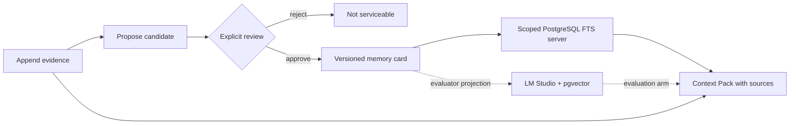

# Go Agent Memory System

A Go-native, evidence-first memory service for agents. It separates raw conversation evidence, untrusted memory proposals, reviewed/versioned memory cards, and the Context Pack assembled for one request.

> **Current status: durable PostgreSQL vertical slice plus measured lexical and dense retrieval components.** The server binary uses PostgreSQL FTS and is covered by real-process restart and deletion-propagation tests. An independently selectable evaluation arm embeds reviewed cards with a local LM Studio `text-embedding-bge-m3` endpoint and runs exact cosine search through pgvector. Two separately reported 30-case fixtures now provide a 60-case policy gate, a harder prospective synthetic retrieval comparison, and deterministic uncertainty output without presenting the dense evaluator path as the production server.

## Why this project exists

An agent checkpoint answers “where should this run resume?” Agent memory answers a different question: “which reviewed facts from earlier sessions are relevant now, and what evidence supports them?” Treating those as the same system makes unverified model output look like durable truth.



The implemented invariants are:

- A candidate is never retrievable before explicit approval.
- Every candidate references source evidence in the same tenant/user scope.
- Approval atomically reviews the candidate, supersedes the prior active identity, inserts version `n+1`, and advances the scope revision.
- PostgreSQL keys, foreign keys, and queries carry both `tenant_id` and `user_id`.
- A Context Pack uses one request-time `as_of` value and returns only active, unexpired cards with the source evidence needed to audit them.
- User erasure transactionally removes evidence, candidates, identity chains, and every card version while retaining a monotonic, content-free revision row.

## Evidence and boundaries

| Capability | Executable evidence | Current boundary |
| --- | --- | --- |
| Evidence → candidate → review → memory | Unit, HTTP, and real PostgreSQL contract tests | Reviewer ID is caller-supplied; no authentication yet |
| Transactional conflict versioning | Concurrent approvals produce v1/v2 with one active card; failure-in-the-middle rolls back | Last-approved-wins, not semantic conflict resolution |
| Tenant/user isolation | Composite database constraints plus cross-scope tests | Scope headers are selectors, not proof of identity |
| Restart recovery | Test starts, SIGTERMs, and restarts the actual server binary against one Docker volume | No backup/restore drill yet |
| Deletion propagation | DELETE commits, PostgreSQL FTS returns nothing, a third server process still sees nothing, and database tables are inspected; pgvector rows cascade with their cards | PostgreSQL backup/PITR deletion policy is not implemented |
| Time-based serviceability | Optional absolute `expires_at` is copied from candidate to card; equality is expired and is checked in storage, retrieval, and Context Pack assembly | Expiration does not delete data or change the card's lifecycle status |
| Offline evaluation | Legacy 8-case smoke fixture plus separate 30-case lifecycle and 30-case semantic-extension datasets; four-arm manifests report quality, deterministic marginal intervals, policy, provenance, latency smoke, and cleanup | Uses authored cards and synthetic queries; the first-look extension is now a regression set and does not measure extraction, concurrent load, answer quality, or production traffic |
| Dense retrieval component | Versioned card documents, a bounded OpenAI-compatible embeddings client, `vector(1024)` projections, exact scoped cosine search, lifecycle cleanup, and a real-component evaluation arm | Evaluator projects synchronously; the server remains FTS and has no outbox, backfill, reconciliation worker, hybrid fusion, or ANN index |

The in-memory adapter remains only for fast unit tests and deterministic offline evaluation. `cmd/server` has no in-memory fallback and fails fast when PostgreSQL is unavailable.

## Run locally

Requirements:

- Go 1.25+
- Docker Engine with Docker Compose
- LM Studio serving `text-embedding-bge-m3` on an OpenAI-compatible embeddings endpoint, only for vector verification

Make invokes Go with `GOSUMDB=$(GO_CHECKSUM_DB)` and defaults `GO_CHECKSUM_DB` to `sum.golang.org`, so an auto-downloaded Go toolchain is checksum-verified even when the surrounding shell disables the checksum database. Environments using an approved checksum mirror can override that project variable.

Start PostgreSQL, apply the same embedded migration used by the server, and run all Docker-backed integration tests:

```bash
make verify
make verify-postgres
```

`make verify-postgres` leaves the healthy PostgreSQL container and its named volume running. Start the API on loopback:

```bash
make server
```

Check process liveness and database readiness separately:

```bash
curl -sS http://127.0.0.1:8080/healthz
curl -sS http://127.0.0.1:8080/readyz
```

Stop the container without deleting data:

```bash
make db-down
```

Docker Compose uses `pgvector/pgvector:0.8.6-pg18-bookworm`, binds PostgreSQL only to `127.0.0.1:55432`, and stores data in `go-agent-memory-system_postgres-data`. Running `docker compose down --volumes` permanently deletes that development volume.

The default development credentials are listed in `.env.example`. Make does not load `.env`; pass overrides through the shell or on the Make command line. It exports `POSTGRES_DB`, `POSTGRES_USER`, `POSTGRES_PASSWORD`, and `POSTGRES_PORT` to Compose and derives the default DSN without printing it. A complete `DATABASE_URL`/`TEST_DATABASE_URL` can also be supplied. The binaries intentionally do not accept DSN flags, keeping credentials out of their advertised process arguments. Changing initialization credentials does not rewrite an existing PostgreSQL volume; recreating that disposable development volume is a separate, destructive operation.

The vector targets read `LMSTUDIO_EMBEDDINGS_URL` and `LMSTUDIO_EMBEDDING_MODEL` from the environment; defaults match the local endpoint shown in `.env.example`. The endpoint is deliberately excluded from process arguments, errors, evaluation descriptors, and manifests. Keep LM Studio running before invoking `make verify-vector`.

## Exercise the lifecycle

### 1. Append evidence

```bash
curl -sS http://127.0.0.1:8080/v1/evidence \
  -H 'Content-Type: application/json' \
  -H 'X-Tenant-ID: demo' \
  -H 'X-User-ID: user-1' \
  -d '{
    "event_id": "evt_demo_1",
    "session_id": "session-1",
    "actor": "user",
    "content": "I prefer window seats on flights."
  }'
```

### 2. Propose a memory candidate

```bash
curl -sS http://127.0.0.1:8080/v1/memory-candidates \
  -H 'Content-Type: application/json' \
  -H 'X-Tenant-ID: demo' \
  -H 'X-User-ID: user-1' \
  -d '{
    "kind": "semantic",
    "category": "travel",
    "key": "seat_preference",
    "value": "window seat",
    "person": "self",
    "relationship": "self",
    "backstory": "Directly stated during flight planning.",
    "source_event_ids": ["evt_demo_1"],
    "extractor": "manual-demo",
    "extractor_version": "v1",
    "expires_at": "2099-01-02T03:04:05Z"
  }'
```

Copy the returned candidate ID into the review request. A pending candidate is not serviceable.

### 3. Review and promote it

```bash
CANDIDATE_ID='replace-with-returned-candidate-id'
curl -sS "http://127.0.0.1:8080/v1/memory-candidates/${CANDIDATE_ID}/reviews" \
  -H 'Content-Type: application/json' \
  -H 'X-Tenant-ID: demo' \
  -H 'X-User-ID: user-1' \
  -d '{
    "decision": "approve",
    "reviewer_id": "human-reviewer",
    "reason": "The source directly states this preference."
  }'
```

### 4. Build a Context Pack

```bash
curl -sS http://127.0.0.1:8080/v1/context-packs \
  -H 'Content-Type: application/json' \
  -H 'X-Tenant-ID: demo' \
  -H 'X-User-ID: user-1' \
  -d '{"query":"Which seat does the user prefer?","limit":5}'
```

The full HTTP contract is in [`api/openapi.yaml`](api/openapi.yaml).

## Verification commands

```bash
make verify             # format, vet, unit tests, race tests, build
make verify-postgres    # Docker health, migrations, PG/process tests + real FTS policy gate
make eval               # deterministic lexical smoke evaluation
make eval-v2            # 30-case no-memory vs reviewed-card BM25 policy gate
make eval-postgres      # same 30 cases across no-memory, Go BM25, and real PG FTS
make verify-vector      # real LM Studio + pgvector integration/race tests and four-arm gate
make eval-vector        # same 30 cases across all four independently selectable arms
make verify-semantic    # frozen semantic-extension integration tests and four-arm policy gate
make eval-semantic      # harder 30-case semantic extension; clean committed checkout required
```

The PostgreSQL test tag is intentionally strict: invoking it directly without `TEST_DATABASE_URL`, or invoking the process test without `TEST_SERVER_BINARY`, fails instead of silently skipping.

To retain a machine-readable v2 run from a clean committed revision:

```bash
make eval-recorded
make eval-postgres-recorded
make eval-vector-recorded
make eval-semantic-recorded
```

The recorded targets verify that the binary's build revision matches a clean runtime checkout before atomically writing under `artifacts/eval/`. PostgreSQL arms record non-sensitive component metadata. The vector arm additionally records dimension, exact-search strategy, versioned document/query formats, returned model alias, and a fixed-input vector hash. That hash detects observed behavior drift; it is not a model-weights hash. Connection details never enter the manifest, and Make passes URLs through the environment instead of process arguments. Artifacts are ignored by Git by default, so retaining or publishing one is a separate evidence decision.

The versioned lifecycle fixtures are synthetic. The v2 runner executes real application lifecycle calls—including approval, rejection, supersession, expiration, erasure, and cross-scope queries. PostgreSQL arms give each case a random physical tenant/user namespace and prove complete content, vector, and revision-state cleanup. Dense indexing happens only after the reviewed-card transaction commits; the evaluator then calls LM Studio and performs a short active-card-checked projection transaction. A late vector write after supersession or erasure is rejected. This is local component evidence, not production search performance, extraction quality, or a deployed indexing pipeline.

On the current 30-case fixture, PostgreSQL FTS reaches Recall@5 `0.6667`, MRR `0.6250`, and nDCG@10 `0.6170`; deterministic Go BM25 reaches `1.0000`, `0.9792`, and `0.9843`; and the local `text-embedding-bge-m3`/pgvector arm reaches `1.0000`, `0.9792`, and `0.9739`. Dense retrieval recovers all eight FTS misses. Every retrieval arm passes all scope, lifecycle, expiration, payload, source-provenance, and cleanup policy checks. The measured dense p50/p95 was about `34.2/42.5 ms` for query embedding plus exact PostgreSQL search on this machine; it is a smoke observation, not an SLA or load benchmark.

On the separately frozen semantic extension, which gives every positive query at least 12 serviceable cards and five strict hard negatives, BM25 reaches Recall@5 `0.8333`, MRR `0.7115`, and nDCG@10 `0.6158`; PostgreSQL FTS reaches `0.5208`, `0.4428`, and `0.3894`; and the local dense arm reaches `1.0000`, `0.9479`, and `0.8912`. The dense Recall interval is `[1.0000, 1.0000]` but is explicitly boundary-degenerate, not a production guarantee. Across both 30-case manifests every policy and execution counter is zero, while all eval-scoped lifecycle/vector rows are cleaned up. The extension was authored and frozen before its first retrieval run, but it is still synthetic rather than independently collected; after that first look it is a regression set. See the [semantic first-look report](docs/evaluation-semantic-v1-results.md) for intervals, bad cases, exact revisions, and manifest hashes.

See [`docs/architecture.md`](docs/architecture.md) for transaction boundaries and [`docs/evaluation.md`](docs/evaluation.md) for metric semantics and evidence levels.

## Repository layout

```text
api/                         OpenAPI contract
cmd/server/                  PostgreSQL-backed HTTP service and process test
cmd/migrate/                 Explicit embedded-migration runner
cmd/eval/                    Deterministic offline evaluation
datasets/                    Versioned evaluation fixtures
docs/                        Architecture, ADRs, and evaluation policy
internal/api/                Strict HTTP/JSON boundary
internal/app/                Memory lifecycle application service
internal/domain/             Evidence, candidate, card, context, deletion types
internal/embedding/          Bounded LM Studio client and versioned card documents
internal/migrations/         Tern runner and versioned SQL
internal/retrieval/          Deterministic in-memory BM25 baseline
internal/store/memstore/     Unit/evaluation test double
internal/store/postgres/     Durable transactions, FTS, pgvector, eval isolation, tests
compose.yaml                 Local PostgreSQL/pgvector service
```

## Roadmap

1. Add a transactional outbox, idempotent embedding worker, backfill, and reconciliation before switching the server to dense or hybrid retrieval.
2. Compare reciprocal-rank fusion/reranking against the retained FTS and dense ranking errors; add ANN only after a scale/load benchmark justifies its recall tradeoff.
3. Add an independently sourced, blinded evaluation cohort and paired comparison before making a model-promotion claim.
4. Add authenticated principals, authorization, PII policy, rate limits, redacted observability, backup/restore, and backup-aware erasure.
5. Add a structured model extractor and verifier with explicit human-escalation policy.

Planned work must not be represented as completed or production-deployed capability.
