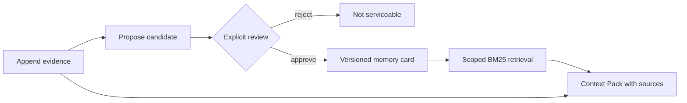

# Go Agent Memory System

A Go-native, evidence-first memory service for agents. It separates raw conversation evidence, untrusted memory proposals, reviewed/versioned memory cards, and the Context Pack assembled for one request.

> **Current status: durable PostgreSQL vertical slice plus deterministic retrieval gate.** The server binary uses PostgreSQL started by Docker Compose, applies embedded transactional migrations, and has real-process restart and deletion-propagation tests. Retrieval is still deterministic BM25 over active PostgreSQL cards. A 28-case lifecycle benchmark compares no-memory and reviewed-card BM25 arms. The pgvector extension is installed for the next retrieval phase, but embeddings and vector search are not implemented.

## Why this project exists

An agent checkpoint answers “where should this run resume?” Agent memory answers a different question: “which reviewed facts from earlier sessions are relevant now, and what evidence supports them?” Treating those as the same system makes unverified model output look like durable truth.



The implemented invariants are:

- A candidate is never retrievable before explicit approval.
- Every candidate references source evidence in the same tenant/user scope.
- Approval atomically reviews the candidate, supersedes the prior active identity, inserts version `n+1`, and advances the scope revision.
- PostgreSQL keys, foreign keys, and queries carry both `tenant_id` and `user_id`.
- A Context Pack returns active cards with the source evidence needed to audit them.
- User erasure transactionally removes evidence, candidates, identity chains, and every card version while retaining a monotonic, content-free revision row.

## Evidence and boundaries

| Capability | Executable evidence | Current boundary |
| --- | --- | --- |
| Evidence → candidate → review → memory | Unit, HTTP, and real PostgreSQL contract tests | Reviewer ID is caller-supplied; no authentication yet |
| Transactional conflict versioning | Concurrent approvals produce v1/v2 with one active card; failure-in-the-middle rolls back | Last-approved-wins, not semantic conflict resolution |
| Tenant/user isolation | Composite database constraints plus cross-scope tests | Scope headers are selectors, not proof of identity |
| Restart recovery | Test starts, SIGTERMs, and restarts the actual server binary against one Docker volume | No backup/restore drill yet |
| Deletion propagation | DELETE commits, BM25 returns nothing, a third server process still sees nothing, and database tables are inspected | Covers PostgreSQL and the live BM25 path; there is no external vector index or backup deletion policy |
| Offline evaluation | Legacy 8-case smoke fixture plus a strict 28-case lifecycle dataset; multi-arm manifests report Recall@K, MRR, nDCG, policy failures, source invariants, and smoke timing | Uses authored cards and the in-memory adapter; it does not measure extraction, PostgreSQL retrieval, embeddings, load, or production traffic |
| pgvector | Docker image and migration create extension `vector` | No vector column, embedding model, ANN index, or vector query yet |

The in-memory adapter remains only for fast unit tests and deterministic offline evaluation. `cmd/server` has no in-memory fallback and fails fast when PostgreSQL is unavailable.

## Run locally

Requirements:

- Go 1.25+
- Docker Engine with Docker Compose

Make invokes Go with `GOSUMDB=$(GO_CHECKSUM_DB)` and defaults `GO_CHECKSUM_DB` to `sum.golang.org`, so an auto-downloaded Go toolchain is checksum-verified even when the surrounding shell disables the checksum database. Environments using an approved checksum mirror can override that project variable.

Start PostgreSQL, apply the same embedded migration used by the server, and run all Docker-backed integration tests:

```bash
make verify
make verify-postgres
```

`make verify-postgres` leaves the healthy PostgreSQL container and its named volume running. Start the API on loopback:

```bash
make server
```

Check process liveness and database readiness separately:

```bash
curl -sS http://127.0.0.1:8080/healthz
curl -sS http://127.0.0.1:8080/readyz
```

Stop the container without deleting data:

```bash
make db-down
```

Docker Compose uses `pgvector/pgvector:0.8.6-pg18-bookworm`, binds PostgreSQL only to `127.0.0.1:55432`, and stores data in `go-agent-memory-system_postgres-data`. Running `docker compose down --volumes` permanently deletes that development volume.

The default development credentials are listed in `.env.example`. Make does not load `.env`; pass overrides through the shell or on the Make command line. It exports `POSTGRES_DB`, `POSTGRES_USER`, `POSTGRES_PASSWORD`, and `POSTGRES_PORT` to Compose and derives the default DSN without printing it. A complete `DATABASE_URL`/`TEST_DATABASE_URL` can also be supplied. Changing initialization credentials does not rewrite an existing PostgreSQL volume; recreating that disposable development volume is a separate, destructive operation.

## Exercise the lifecycle

### 1. Append evidence

```bash
curl -sS http://127.0.0.1:8080/v1/evidence \
  -H 'Content-Type: application/json' \
  -H 'X-Tenant-ID: demo' \
  -H 'X-User-ID: user-1' \
  -d '{
    "event_id": "evt_demo_1",
    "session_id": "session-1",
    "actor": "user",
    "content": "I prefer window seats on flights."
  }'
```

### 2. Propose a memory candidate

```bash
curl -sS http://127.0.0.1:8080/v1/memory-candidates \
  -H 'Content-Type: application/json' \
  -H 'X-Tenant-ID: demo' \
  -H 'X-User-ID: user-1' \
  -d '{
    "kind": "semantic",
    "category": "travel",
    "key": "seat_preference",
    "value": "window seat",
    "person": "self",
    "relationship": "self",
    "backstory": "Directly stated during flight planning.",
    "source_event_ids": ["evt_demo_1"],
    "extractor": "manual-demo",
    "extractor_version": "v1"
  }'
```

Copy the returned candidate ID into the review request. A pending candidate is not serviceable.

### 3. Review and promote it

```bash
CANDIDATE_ID='replace-with-returned-candidate-id'
curl -sS "http://127.0.0.1:8080/v1/memory-candidates/${CANDIDATE_ID}/reviews" \
  -H 'Content-Type: application/json' \
  -H 'X-Tenant-ID: demo' \
  -H 'X-User-ID: user-1' \
  -d '{
    "decision": "approve",
    "reviewer_id": "human-reviewer",
    "reason": "The source directly states this preference."
  }'
```

### 4. Build a Context Pack

```bash
curl -sS http://127.0.0.1:8080/v1/context-packs \
  -H 'Content-Type: application/json' \
  -H 'X-Tenant-ID: demo' \
  -H 'X-User-ID: user-1' \
  -d '{"query":"Which seat does the user prefer?","limit":5}'
```

The full HTTP contract is in [`api/openapi.yaml`](api/openapi.yaml).

## Verification commands

```bash
make verify             # format, vet, unit tests, race tests, build
make verify-postgres    # Docker health, migration, PG contract + process tests
make eval               # deterministic lexical smoke evaluation
make eval-v2            # 28-case no-memory vs reviewed-card BM25 policy gate
```

The PostgreSQL test tag is intentionally strict: invoking it directly without `TEST_DATABASE_URL`, or invoking the process test without `TEST_SERVER_BINARY`, fails instead of silently skipping.

To retain a machine-readable v2 run from a clean committed revision:

```bash
make eval-recorded
```

`eval-recorded` verifies that the binary's build revision matches a clean runtime checkout before atomically writing `artifacts/eval/memory-lifecycle-v2-latest.json`. The artifact is ignored by Git by default; retaining or publishing it is a separate evidence decision.

Both fixtures are synthetic. The v2 runner executes real application lifecycle calls—including approval, rejection, supersession, erasure, and cross-scope queries—but uses the in-memory Store for deterministic comparison. It therefore proves the fixture lifecycle and retrieval-policy behavior, not PostgreSQL search performance, embedding quality, LLM extraction, or production retrieval quality.

See [`docs/architecture.md`](docs/architecture.md) for transaction boundaries and [`docs/evaluation.md`](docs/evaluation.md) for metric semantics and evidence levels.

## Repository layout

```text
api/                         OpenAPI contract
cmd/server/                  PostgreSQL-backed HTTP service and process test
cmd/migrate/                 Explicit embedded-migration runner
cmd/eval/                    Deterministic offline evaluation
datasets/                    Versioned evaluation fixtures
docs/                        Architecture, ADRs, and evaluation policy
internal/api/                Strict HTTP/JSON boundary
internal/app/                Memory lifecycle application service
internal/domain/             Evidence, candidate, card, context, deletion types
internal/migrations/         Tern runner and versioned SQL
internal/retrieval/          Deterministic BM25 baseline
internal/store/memstore/     Unit/evaluation test double
internal/store/postgres/     Durable transactional adapter and contract tests
compose.yaml                 Local PostgreSQL/pgvector service
```

## Roadmap

1. Add real time-based serviceability semantics and the two deferred expiration cases, then grow the 30-case gate toward roughly 60 held-out multi-session cases.
2. Add PostgreSQL full-text search and one real `text-embedding-bge-m3`/pgvector retrieval arm, then compare them on the same dataset.
3. Add reciprocal-rank fusion/reranking only if the measured baseline justifies it.
4. Add authenticated principals, authorization, PII policy, rate limits, redacted observability, backup/restore, and backup-aware erasure.
5. Add a structured model extractor and verifier with explicit human-escalation policy.

Planned work must not be represented as completed or production-deployed capability.
