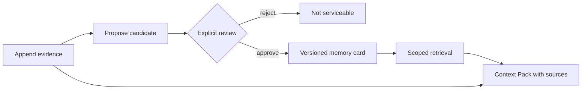

# Go Agent Memory System

A Go-native, evidence-first memory service for agents. The project separates immutable conversation evidence, untrusted memory proposals, reviewed/versioned memory cards, and the context assembled for one request.

> **Current status: Phase 0 walking skeleton.** The lifecycle and its safety invariants run locally with an in-memory store and a deterministic BM25 baseline. PostgreSQL/pgvector, real model extraction, authentication, PII redaction, and production observability are not implemented yet.

## Why this project exists

An agent checkpoint answers “where should this run resume?” Agent memory answers a different question: “which reviewed facts from earlier sessions are relevant now, and what evidence supports them?” Treating those as the same system makes unverified model output look like durable truth.

This repository implements the lifecycle explicitly:



The core invariants are:

- A candidate is never retrievable before explicit approval.
- Every candidate references source evidence in the same tenant and user scope.
- Approving the same memory identity creates a new active version and supersedes the old one.
- Every lookup is scoped by both `tenant_id` and `user_id`.
- A Context Pack returns memory cards and the source evidence needed to audit them.
- Explicit user erasure removes evidence, candidates, and serviceable memories in the current adapter.

## What is implemented

| Capability | Current evidence | Boundary |
| --- | --- | --- |
| Evidence → candidate → review → memory lifecycle | Service and HTTP integration tests | In-memory only |
| Conflict versioning | A new approved value supersedes the prior active card | No merge or human-review UI yet |
| Tenant/user isolation | Cross-scope source and retrieval tests | Scope headers are not authentication |
| Context Pack with source back-links | API returns ranked cards plus evidence | Lexical retrieval only |
| User erasure | Test asserts no later retrieval and no source lookup | No distributed deletion or backup policy yet |
| Offline evaluation manifest | Versioned 8-case synthetic smoke dataset, SHA-256, per-case ranks | Not a production benchmark or model evaluation |

## Run it

Requirements: Go 1.24+.

```bash
make verify
go run ./cmd/server -addr 127.0.0.1:8080
```

The server intentionally uses no external dependency in Phase 0 and binds only to loopback by default. Data is lost when the process exits.

### 1. Append evidence

```bash
curl -sS http://localhost:8080/v1/evidence \
  -H 'Content-Type: application/json' \
  -H 'X-Tenant-ID: demo' \
  -H 'X-User-ID: user-1' \
  -d '{
    "event_id": "evt_demo_1",
    "session_id": "session-1",
    "actor": "user",
    "content": "I prefer window seats on flights."
  }'
```

### 2. Propose a memory candidate

```bash
curl -sS http://localhost:8080/v1/memory-candidates \
  -H 'Content-Type: application/json' \
  -H 'X-Tenant-ID: demo' \
  -H 'X-User-ID: user-1' \
  -d '{
    "kind": "semantic",
    "category": "travel",
    "key": "seat_preference",
    "value": "window seat",
    "person": "self",
    "relationship": "self",
    "backstory": "Directly stated during flight planning.",
    "source_event_ids": ["evt_demo_1"],
    "extractor": "manual-demo",
    "extractor_version": "v1"
  }'
```

Copy the returned candidate ID into the review request. A pending candidate will not appear in retrieval.

### 3. Review and promote it

```bash
curl -sS http://localhost:8080/v1/memory-candidates/<candidate_id>/reviews \
  -H 'Content-Type: application/json' \
  -H 'X-Tenant-ID: demo' \
  -H 'X-User-ID: user-1' \
  -d '{
    "decision": "approve",
    "reviewer_id": "human-reviewer",
    "reason": "The source directly states this preference."
  }'
```

### 4. Build a Context Pack

```bash
curl -sS http://localhost:8080/v1/context-packs \
  -H 'Content-Type: application/json' \
  -H 'X-Tenant-ID: demo' \
  -H 'X-User-ID: user-1' \
  -d '{"query":"Which seat does the user prefer?","limit":5}'
```

The full HTTP contract is in [`api/openapi.yaml`](api/openapi.yaml).

## Run the retrieval smoke evaluation

```bash
make eval

# Optionally retain a machine-readable local run artifact.
go run ./cmd/eval \
  -dataset ./datasets/retrieval-smoke-v1.json \
  -k 5 \
  -output ./artifacts/eval/latest.json
```

The manifest records the dataset ID/version/hash, source revision state, Go version, retrieval arm, per-case rankings, Recall@K, MRR, and pass rate. The current dataset is deliberately small and synthetic; a perfect score only proves the local pipeline and metric plumbing work.

See [`docs/evaluation.md`](docs/evaluation.md) for metric semantics and the evidence boundary.

## Repository layout

```text
api/                    OpenAPI contract
cmd/server/             HTTP service entry point
cmd/eval/               Offline evaluation entry point
datasets/               Versioned evaluation fixtures
docs/                    Architecture, ADRs, and evaluation policy
internal/api/           Strict HTTP/JSON boundary
internal/app/           Memory lifecycle application service
internal/domain/        Evidence, candidate, card, context, deletion types
internal/retrieval/     Deterministic BM25 baseline
internal/store/         Storage contract and in-memory adapter
```

## Roadmap

1. **Evaluation gate:** grow the hard cases continuously toward approximately 60 multi-session cases; retain clean-revision manifests and compare each later retrieval arm on the same data.
2. **Durable evidence layer:** PostgreSQL schema/migrations, transactional version promotion, restart and deletion tests.
3. **Real retrieval:** PostgreSQL FTS + pgvector, reciprocal-rank fusion, reranking, and retrieval-level ACL enforcement.
4. **Model pipeline:** structured extractor, evidence verifier, PII policy, asynchronous jobs, and human escalation.
5. **Dual-layer memory:** Advanced JSON Cards for always-on facts plus contextual retrieval over raw conversations; compare no-memory, cards-only, RAG-only, and dual-layer arms.
6. **Operations:** OpenTelemetry traces, redacted logging, rate limits, authentication/authorization, backups, and deletion receipts across derived indexes.

Design details live in [`docs/architecture.md`](docs/architecture.md). Planned work must not be represented as completed or production-deployed capability.
