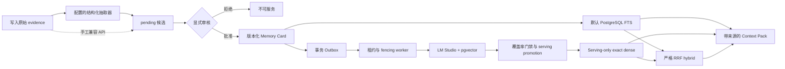

# Go Agent Memory System

[English](README.md) | [中文](README_zh.md)

**版本：** `v0.1.0-alpha` —— 用于本地评估的实验性软件，尚未达到生产可用状态。

> [!WARNING]
> HTTP API 尚未实现认证和授权。`X-Tenant-ID`、`X-User-ID` 与 reviewer ID 都是调用方传入的 selector，不是可信身份。请仅在可信 loopback 或隔离的开发网络中运行，不要直接暴露到公网。

这是一个 Go 原生、证据优先的 Agent 长期记忆服务。它把原始证据、未经信任的记忆候选、经过显式审核的版本化 Memory Card，以及单次请求使用的 Context Pack 分成不同层次。

> **当前状态：已实现 PostgreSQL 持久化生命周期、可选的结构化 evidence 自动抽取，以及显式选择的 FTS、Dense 和 Hybrid 检索路径。** 自动抽取只能把已持久化的 evidence 转换成带来源的 `pending` 候选，不能自动批准。默认检索仍是 PostgreSQL FTS，不依赖抽取模型或 embedding 模型。这些结论来自本地组件和进程测试，不代表生产部署、抽取准确率、事实校验能力、ANN/负载结果或可用性 SLA。

## 这个项目解决什么问题

Agent checkpoint 回答“任务应该从哪里恢复”，Agent memory 回答“过去会话中哪些已审核事实与当前请求相关，以及依据是什么”。如果混为一谈，模型未经验证的输出就可能被误当作长期事实。



核心约束：

- 自动抽取请求只接受当前 tenant/user scope 中已经存在的 evidence ID，不接受调用方手写候选业务字段。
- 一次请求接受 1～20 个不重复的 source ID；加载后的 evidence content 总计不得超过 64 KiB；模型最多返回 10 个候选。
- 模型调用不持有数据库事务。完整响应通过严格解析和校验后，所有 `pending` 候选才在一个 scope-serialized、revision-fenced 事务中全部写入；任一步失败都写入 0 条。
- 每个 support quote 不得超过 1024 bytes，且必须逐字存在于引用的 evidence 中。这个检查只证明机械可追溯，不能证明语义蕴含或事实真实性。
- 候选必须经过既有显式审核才能创建 Memory Card；`pending` 或 rejected 候选永远不能进入 Context Pack。
- PostgreSQL 的主键、外键和查询始终同时携带 `tenant_id` 与 `user_id`。
- 用户删除在一个事务中清除 evidence、候选、所有 Memory Card 版本、projection job 和向量，并保留不含内容的单调 revision 行。
- 默认 FTS、显式 Dense 和严格 Hybrid 都只返回 active、未过期、仍保留来源的已审核 Memory Card。

## 已验证能力与边界

| 能力 | 可执行证据 | 当前边界 |
| --- | --- | --- |
| 已持久化 evidence → 自动 pending 候选 | fake model 的 client/application 与真实 server 进程测试、内存与 PostgreSQL 原子批量测试、严格来源与 quote 校验 | quote 包含只证明字节级可追溯；尚无真实抽取质量基准或生产模型结论 |
| 候选 → 显式审核 → Memory Card | 单元、HTTP 与真实 PostgreSQL 契约测试 | reviewer ID 由调用方提供，尚无认证或审核人身份绑定 |
| 租户/用户隔离 | 组合约束、scoped SQL 和跨 scope 测试 | `X-Tenant-ID` / `X-User-ID` 只是 scope selector，不是身份凭证 |
| 版本与冲突 | 并发审核生成 v1/v2 且只保留一个 active 版本；中途失败整体回滚 | last-approved-wins，不是语义冲突解决器 |
| 删除传播与重启恢复 | Docker PostgreSQL、真实 server/worker 杀进程重启、删除后表级检查 | 未实现备份/PITR 感知的删除策略；无法撤回已发送给 provider 的请求 |
| FTS / Dense / Hybrid | PostgreSQL FTS、exact pgvector cosine、严格 RRF `k=60`、固定失败语义、进程级删除与重启测试 | FTS 为默认；无静默降级、ANN、负载/SLA 或生产流量结论 |
| 离线评测 | 8-case smoke、30-case lifecycle、30-case semantic-extension 数据集与确定性 manifest | 数据集与 Memory Card 为人工编写，不能证明自动抽取或答案质量 |

内存 Store 仅用于快速单元测试和确定性离线评测。`cmd/server` 不会回退到内存存储，PostgreSQL 不可用时启动失败。

## 本地运行

### 依赖

- Go 1.25+
- Docker Engine 与 Docker Compose
- 需要向量验证、projection worker 或首次 promotion 时：LM Studio 在 OpenAI-compatible embeddings endpoint 上运行 `text-embedding-bge-m3`
- 需要自动候选抽取时：另行配置一个兼容 chat-completions 且支持严格 JSON Schema 输出的模型；自动化测试只使用 fake server，不依赖真实外部模型

### 1. 启动 Docker PostgreSQL 并迁移

```bash
make db-up
make migrate
```

Compose 使用 `pgvector/pgvector:0.8.6-pg18-bookworm`，只绑定 `127.0.0.1:55432`，数据保存在 `go-agent-memory-system_postgres-data` volume。迁移由应用内嵌 SQL 事务化执行，不依赖容器初始化目录。

也可以直接运行基础验收：

```bash
make verify
make verify-postgres
```

### 2. 配置与启动 HTTP 服务

默认开发数据库配置见 `.env.example`。Make 不会自动加载 `.env`，请通过当前 shell 或 Make 参数传入覆盖值。数据库连接串只通过环境传递，不作为进程参数。

自动抽取默认关闭，并与检索模式相互独立。启动 server 前可这样配置：

```bash
export MEMORY_EXTRACTION_ENABLED=true
export MEMORY_EXTRACTION_ENDPOINT='http://127.0.0.1:1234/v1/chat/completions'
export MEMORY_EXTRACTION_MODEL='替换为支持结构化输出的模型'
export MEMORY_EXTRACTION_AUTH_MODE=none # none 或 bearer
export MEMORY_EXTRACTION_TIMEOUT=10s    # 默认 10s，最大 120s
export MEMORY_EXTRACTION_EXTRACTOR_NAME='structured-evidence-extractor'
export MEMORY_EXTRACTION_EXTRACTOR_VERSION='v1'
# 只有 AUTH_MODE=bearer 时才设置 MEMORY_EXTRACTION_BEARER_TOKEN。
```

关闭时，server 不读取 endpoint、model、鉴权、timeout 和 extractor 描述配置。启用时，endpoint、model、extractor name/version 必填；`AUTH_MODE` 默认 `none`，选择 `bearer` 时 `MEMORY_EXTRACTION_BEARER_TOKEN` 必填。HTTP 请求不能覆盖这些进程级配置。server 的 write timeout 会自动调整为 extraction timeout 加 5 秒响应余量。远程 endpoint 会收到 evidence content，因此上线前必须独立评审 TLS、密钥、隐私、数据驻留、保留与删除策略。

启动默认 FTS 服务：

```bash
make server
```

检查 liveness 与 readiness：

```bash
curl -sS http://127.0.0.1:8080/healthz
curl -sS http://127.0.0.1:8080/readyz
```

`/healthz` 只证明进程存活。`/readyz` 检查 PostgreSQL，以及 Dense/Hybrid 模式下的 serving pin 和 embedding probe；它不探测可选抽取器。抽取 provider 故障不会让既有已审核记忆停止检索。

只有在 durable worker、reconciliation 和 promotion 全部完成后，才应显式启动 Dense 或 Hybrid：

```bash
export SERVER_EXPECTED_SERVING_SPACE="$PROJECTION_WORKER_EMBEDDING_SPACE"
make server-dense
make server-hybrid
```

停止容器但保留数据：

```bash
make db-down
```

`docker compose down --volumes` 会永久删除开发 volume，请不要把它当作普通停止命令。

## 完整调用演示：自动抽取 → 审核 → 检索

以下调用都使用同一组 scope header。它们不是认证凭证；生产环境仍需可信身份与授权层。

### 1. 写入原始 evidence

```bash
curl -sS http://127.0.0.1:8080/v1/evidence \
  -H 'Content-Type: application/json' \
  -H 'X-Tenant-ID: demo' \
  -H 'X-User-ID: user-1' \
  -d '{
    "event_id": "evt_demo_1",
    "session_id": "session-1",
    "actor": "user",
    "content": "I prefer window seats on flights."
  }'
```

当前仓库没有聊天、工单或第三方平台连接器自动完成这一步；业务应用必须显式调用 evidence API。

### 2. 从已持久化 evidence 自动抽取 pending 候选

先通过 `MEMORY_EXTRACTION_*` 配置启用抽取器并重新启动 server，然后执行：

```bash
curl -sS http://127.0.0.1:8080/v1/memory-candidate-extractions \
  -H 'Content-Type: application/json' \
  -H 'X-Tenant-ID: demo' \
  -H 'X-User-ID: user-1' \
  -d '{"source_event_ids":["evt_demo_1"]}'
```

响应允许 `candidates: []`，表示模型没有提出值得记忆的内容；成功返回的每个候选都必须是 `pending`，带 extractor 名称/版本、非敏感审计信息和具体来源。复制其中一个 candidate ID 供下一步审核。在批准之前，用相同语义查询 Context Pack 不会返回它。

同 scope 来源不存在返回 `404`，revision 竞争返回 `409`，抽取关闭或 provider 不可用返回固定 `503`，模型 refusal 或结构化输出无效返回固定 `502`，超时返回 `504`。响应不会包含 endpoint、bearer token、provider body/refusal、prompt 或 evidence content。

### 2a. 手工候选兼容入口

原有 `POST /v1/memory-candidates` 仍可用于 fixture、人工操作和兼容场景，但字段由调用方手写，**不能作为自动抽取已运行的证据**：

```bash
curl -sS http://127.0.0.1:8080/v1/memory-candidates \
  -H 'Content-Type: application/json' \
  -H 'X-Tenant-ID: demo' \
  -H 'X-User-ID: user-1' \
  -d '{
    "kind":"semantic",
    "category":"travel",
    "key":"seat_preference",
    "value":"window seat",
    "person":"self",
    "relationship":"self",
    "backstory":"Directly stated during flight planning.",
    "source_event_ids":["evt_demo_1"],
    "extractor":"manual-demo",
    "extractor_version":"v1"
  }'
```

### 3. 显式审核

```bash
CANDIDATE_ID='替换为返回的候选ID'
curl -sS "http://127.0.0.1:8080/v1/memory-candidates/${CANDIDATE_ID}/reviews" \
  -H 'Content-Type: application/json' \
  -H 'X-Tenant-ID: demo' \
  -H 'X-User-ID: user-1' \
  -d '{
    "decision":"approve",
    "reviewer_id":"human-reviewer",
    "reason":"The source directly states this preference."
  }'
```

批准会创建版本化 Memory Card；拒绝不会创建。项目没有自动审批，也不会因为模型置信度跳过这一步。

### 4. 构建 Context Pack

```bash
curl -sS http://127.0.0.1:8080/v1/context-packs \
  -H 'Content-Type: application/json' \
  -H 'X-Tenant-ID: demo' \
  -H 'X-User-ID: user-1' \
  -d '{"query":"Which seat does the user prefer?","limit":5}'
```

Context Pack 只包含 active、未过期、已审核的 Memory Card 及其 ordered source evidence。完整 HTTP 契约见 [`api/openapi.yaml`](api/openapi.yaml)。当前没有 MCP “直接检索”或 gRPC API。

### 5. 删除用户数据并验证传播

```bash
curl -sS -X DELETE http://127.0.0.1:8080/v1/users/user-1 \
  -H 'X-Tenant-ID: demo'
```

删除提交后，再次查询 Context Pack 应返回 `items: []`。当前保证覆盖主 PostgreSQL、FTS、pgvector 和 projection jobs；不覆盖备份/PITR，也不能撤回已经发送到模型 provider 的内容。

## Projection 与显式 Dense/Hybrid

`.env.example` 提供 LM Studio、worker、reconciler 和 promoter 配置。典型顺序：

```bash
make projection-worker-probe
export PROJECTION_WORKER_EMBEDDING_SPACE='space_v1_替换为probe输出'
make projection-target-register
make projection-worker

export PROJECTION_RECONCILER_EMBEDDING_SPACE="$PROJECTION_WORKER_EMBEDDING_SPACE"
make projection-backfill
make projection-reconcile

export PROJECTION_PROMOTER_EMBEDDING_SPACE="$PROJECTION_WORKER_EMBEDDING_SPACE"
export PROJECTION_PROMOTER_EXPECTED_FROM=none
export PROJECTION_PROMOTER_OPERATION_ID='替换为新的小写UUID'
make projection-promote
```

Worker 使用数据库时钟租约和 fencing，模型 HTTP 期间不持锁；reconciler 只处理数据库任务和覆盖率，不连接 LM Studio；promoter 在一个事务中重新验证所有可服务卡片并原子切换 serving target。它们的 probe 只能发现固定输入上的行为漂移，不能证明模型权重身份或质量。

## 验证命令

```bash
make verify                       # 格式、vet、单元、race、build、基础评测
make verify-postgres              # Docker、迁移、PG/进程测试与 FTS gate
make verify-extraction            # fake model、严格输出、HTTP/app race、真实 server 进程、PG 原子批量
make verify-worker                # worker repository/进程恢复与真实 LM Studio projection
make verify-reconciliation        # generation-fenced backfill/audit
make verify-promotion             # 原子 serving swap 与 receipt replay
make verify-serving-retrieval     # serving SQL、Dense/Hybrid、删除与重启
make verify-vector                # 真实 LM Studio + pgvector
make verify-semantic              # 冻结 semantic-extension gate
```

Extraction 验收应覆盖：多 source 成功、空结果、模型 refusal、timeout、网络/429/5xx、无效或超大 JSON、未知/重复字段、数量和长度越界、跨 scope 或来源不一致、quote 不匹配、重复 identity、批量写入中途故障全回滚、与删除的 revision race，以及 pending 候选不可检索。所有自动化测试使用 fake/stub 模型。

## 安全与事实边界

- Evidence 和模型输出都按不可信数据处理，不能触发工具或改变服务配置。
- JSON Schema、duplicate-key 拒绝、same-scope source 与 exact quote 检查是确定性约束，不是语义 verifier，也不能消除所有 prompt injection 风险。
- `X-Tenant-ID` / `X-User-ID` 不是认证；reviewer ID 也未绑定可信身份。
- 模型 endpoint、凭据、prompt、evidence 内容、provider response/refusal 不进入错误或日志；候选只保留有界的非敏感审计元数据。
- 当前没有业务侧自动 evidence 采集、聊天/工单连接器、自动审批、MCP、gRPC、生产 TLS/secrets/PII policy、备份感知删除、SLO 或负载验证。
- 自动抽取已实现的边界是：上层应用先写入 evidence，再显式调用 HTTP extraction endpoint，得到仍需人工审核的 pending candidate。

## 目录结构

```text
api/                         OpenAPI 契约
cmd/server/                  PostgreSQL HTTP 服务与进程测试
cmd/migrate/                 内嵌迁移入口
cmd/eval/                    确定性离线评测
cmd/projection-worker/       租约/fencing projection worker
cmd/projection-reconciler/   DB-only backfill 与 coverage audit
cmd/projection-promoter/     原子 serving promotion 与 receipt replay
datasets/                    版本化评测 fixture
docs/                        架构、ADR 与评测策略
internal/api/                严格 HTTP/JSON 边界
internal/app/                lifecycle 与 extraction 编排
internal/domain/             evidence、candidate、card、context 类型
internal/extraction/         供应商中立的结构化抽取 client
internal/embedding/          有界 embedding client 与版本化文档
internal/store/memstore/     单元测试 adapter
internal/store/postgres/     事务、FTS、pgvector 与集成测试
compose.yaml                 本地 PostgreSQL/pgvector
```

## 后续工作

1. 使用独立采集、盲测的 extraction fixture 评估候选准确率和遗漏率，并单独设计 semantic verifier 与人工升级策略。
2. 在真实规模与 tenant-filtered recall 基准证明必要后再引入 ANN。
3. 增加可信身份、授权、reviewer 绑定、PII policy、限流和脱敏可观测性。
4. 完成部署/TLS/secrets/supply-chain、备份恢复、PITR 删除传播、SLO/runbook 和容量/故障测试。
5. 如业务确有需要，再单独设计聊天/工单采集连接器或 MCP/gRPC；不能把它们写成当前已实现能力。

规划项不能被表述为已经完成或生产上线。

## 贡献、安全与许可证

欢迎按照 [`CONTRIBUTING.md`](CONTRIBUTING.md) 提交贡献。安全问题请根据 [`SECURITY.md`](SECURITY.md) 私下报告；参与项目社区时请遵守 [`CODE_OF_CONDUCT.md`](CODE_OF_CONDUCT.md)。版本变化记录在 [`CHANGELOG.md`](CHANGELOG.md)。

本项目采用 [MIT License](LICENSE)。
